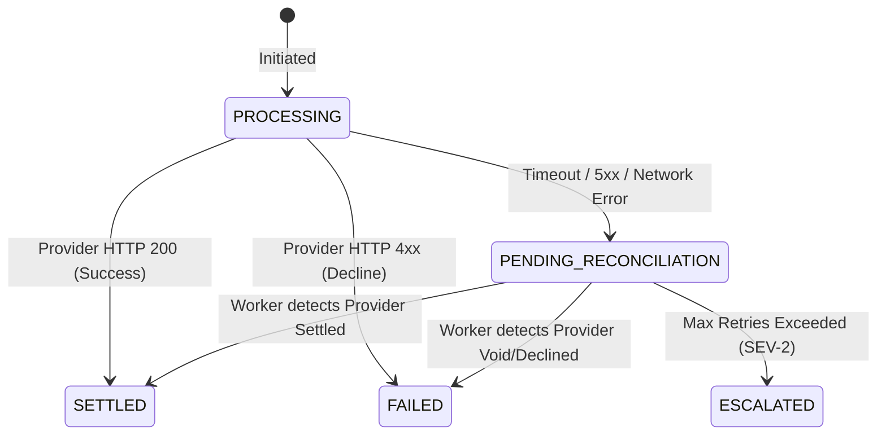

# External Provider Failure Matrix & Ambiguity Handling

**Repository:** `Ankit8303/distributed-payment-platform`  
**Core Invariant:** External providers are untrusted network failure boundaries.  
**Cardinal Rule:** `UNKNOWN != FAILURE`. A network timeout or HTTP 5xx error does NOT prove the transaction was not processed by the external gateway.

---

## 1. Provider Operation Ambiguity Matrix

| Gateway Response / Outcome | Local Financial Action | Reservation State | Payout/Payment State | Reconciliation Required? | Post-Action / Operator Escalation |
| :--- | :--- | :--- | :--- | :---: | :--- |
| **HTTP 200 / 201 (SUCCESS)** | Finalize ledger double-entry debit/credit | `CONSUMED` | `SETTLED` | No | Dispatch settled domain event to transactional outbox. |
| **HTTP 402 / 400 (DECLINE)** | Release reserved funds back to account | `RELEASED` | `FAILED` | No | Record explicit gateway decline reason code in audit log. |
| **HTTP 409 (DUPLICATE KEY)** | Re-query provider using stable operation ID | Maintained `ACTIVE` | Maintain `PROCESSING` | Yes | Match existing remote transaction; reconcile local state. |
| **HTTP 408 / Socket Timeout**| Do NOT mark failed. Treat outcome as UNKNOWN | Maintained `ACTIVE` | `PENDING_RECONCILIATION` | **YES** | Enqueue into `reconciliation_attempts` queue for polling. |
| **Connection Refused / Reset**| Do NOT mark failed. Treat outcome as UNKNOWN | Maintained `ACTIVE` | `PENDING_RECONCILIATION` | **YES** | Exponential backoff poll via Reconciliation Worker. |
| **HTTP 500 / 502 / 503 / 504**| Ambiguous execution at provider | Maintained `ACTIVE` | `PENDING_RECONCILIATION` | **YES** | Provider may have debited beneficiary before upstream error. |
| **Malformed JSON / Parse Error**| Ambiguous receipt | Maintained `ACTIVE` | `PENDING_RECONCILIATION` | **YES** | Flag for automated query; fallback to SEV-2 manual review. |
| **Process Crash Mid-Flight** | Server crash after provider dispatch | Maintained `ACTIVE` | `PENDING_RECONCILIATION` | **YES** | Stale processing recovery detector transitions state on restart. |

---

## 2. Invariant & Recovery Rules

### Rule 1: Never Release Reservations on Ambiguous Failures
Under no circumstances may an `ACTIVE` payout balance reservation be released to `RELEASED` upon encountering a timeout, network disconnect, or HTTP 5xx. If the external provider actually disbursed funds to the rail, releasing the reservation causes double-spending and unbacked ledger deficits.

### Rule 2: Stable Idempotency Keys across Retries
Every external provider call must transmit the durable domain entity identifier (e.g. `payout.getId().toString()`), NOT an ephemeral client UUID generated per retry. This guarantees that gateway-level deduplication catches in-flight retries.

### Rule 3: Database Transactions Never Span Remote Calls
```text
CORRECT FLOW:
1. DB Transaction 1: Create Entity (CREATED) + Reserve Funds (ACTIVE) -> COMMIT.
2. Network Boundary: Invoke Provider HTTP Client (Timeout: connect 2s, read 5s).
3. DB Transaction 2: Process Result (SETTLED or PENDING_RECONCILIATION) -> COMMIT.
```
Holding database row locks or connection pool leases across third-party HTTP round-trips is strictly prohibited.

---

## 3. Automated Reconciliation Lifecycle



1. **Detection:** Schedulers identify records in `PENDING_RECONCILIATION` or stale `PROCESSING` (> 5 minutes).
2. **Deterministic Locking:** Worker acquires pessimistic lock `SELECT ... FOR UPDATE SKIP LOCKED` to prevent duplicate concurrent settlement.
3. **Provider Query:** Worker queries provider status endpoint using stable transaction ID.
4. **Resolution:**
   - Provider confirmed settled -> Settle payout, consume reservation, create ledger entry.
   - Provider confirmed failed -> Fail payout, release reservation.
   - Provider still pending -> Increment attempt counter, schedule next backoff.
