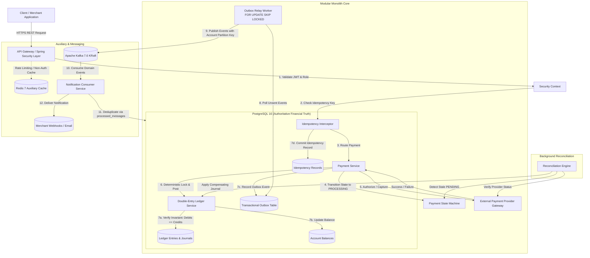
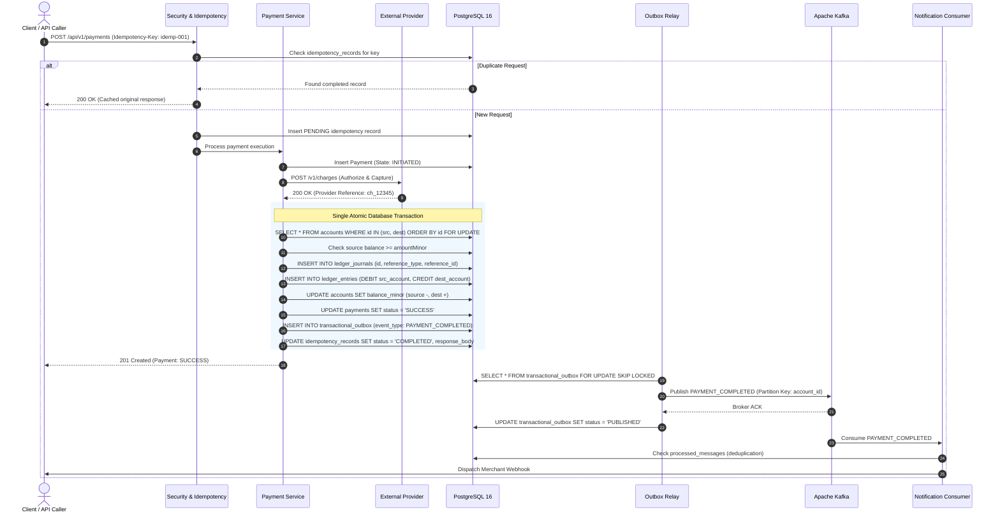

# Distributed Payment & Ledger Platform

[](https://openjdk.org/projects/jdk/21/)
[](https://spring.io/projects/spring-boot)
[](https://www.postgresql.org/)
[-black.svg)](https://kafka.apache.org/)
[](https://redis.io/)
[](https://www.docker.com/)
[](#testing)
[](#production-readiness)

A high-integrity, production-grade distributed payment and immutable double-entry ledger platform built with Java 21, Spring Boot 3.3.4, PostgreSQL 16, Apache Kafka, and Redis. Architected as a domain-driven modular monolith with deterministic locking, transactional outbox delivery, and strict financial invariants enforced in the database.

---

## Why This Project Exists

In modern financial and commerce infrastructure, generic CRUD applications with eventual consistency or floating-point arithmetic inevitably cause:
1. **Silent Balance Drift**: Unenforced balance accounting and floating-point roundoff errors lead to discrepancies between user balances and transactional journals.
2. **Duplicate Settlements**: Distributed network timeouts cause clients to retry payment requests, risking duplicate withdrawals and double-captures.
3. **Dual-Write Inconsistencies**: Updating an operational database and emitting a message broker event separately leads to data loss if either step crashes before both commit.
4. **Concurrency Deadlocks**: High-velocity bidirectional transfers between the same account pairs cause database lock contention and deadlocks under concurrent load.
5. **Ambiguous Provider Failures**: When third-party payment gateways time out or drop network connections, payments are left in unverified states without automated reconciliation.

This platform solves these problems through an uncompromising, defense-in-depth financial architecture where **PostgreSQL serves as the sole source of financial truth**, wrapped in verifiable transaction boundaries, immutable ledger posting, and deterministic replay-safe payment semantics.

---

## Key Engineering Guarantees

- **PostgreSQL is the Financial Source of Truth**: All account balances, double-entry transaction journals, idempotency keys, and transactional outbox events commit authoritatively within PostgreSQL.
- **Immutable Double-Entry Ledger**: Every posted ledger transaction strictly balances:
  $$\sum \text{Debits} == \sum \text{Credits}$$
  Database row-level immutability rules prevent `UPDATE` or `DELETE` on posted entries.
- **Integer Minor-Unit Money**: All monetary amounts are represented as 64-bit integer minor units (`amountMinor` in cents/pence); floating-point math is strictly forbidden.
- **Database-Level Payment Idempotency**: Idempotency is enforced durably in the database via a unique constraint on `(actor_id, operation, idempotency_key)` in `idempotency_records`.
- **Deterministic Concurrency Control**: Cross-account transfers lock participating accounts in strict lexicographical UUID order, mathematically eliminating database deadlocks during bidirectional transfer bursts.
- **Transactional Outbox Pattern**: Domain state transitions and outbox events commit in the exact same database transaction, guaranteeing zero dual-write loss.
- **Kafka At-Least-Once Delivery**: Events are relayed from the outbox table via `FOR UPDATE SKIP LOCKED` worker leases to Kafka topics partitioned by `accountId` for sequential delivery.
- **Consumer Deduplication**: Asynchronous consumers maintain idempotency via `processed_messages` database tables, discarding duplicate Kafka deliveries.
- **Redis is Strictly Auxiliary**: Redis is utilized exclusively for distributed rate limiting, transient distributed locks, and non-authoritative caching. Financial state is never stored in Redis.
- **Automated Payment Reconciliation**: A dedicated reconciliation engine identifies pending or ambiguous provider states, queries provider verification endpoints, and executes deterministic resolution or compensating entries.
- **Compensating Financial Reversals**: Adjustments, refunds, and chargebacks are executed exclusively by posting new compensating double-entry ledger entries. Historical records are never altered.
- **Admin Financial Restrictions**: Strict separation of duties prevents administrative balance manipulation. Admins can audit, freeze, and trigger reconciliation, but cannot directly edit balances or posted journals.

---

## Architecture

The platform is designed as an event-driven modular monolith, separating domain contexts into clean compile-time boundaries while eliminating distributed network latency within the critical transactional path.



---

## Core Financial Flow

A standard end-to-end payment settlement executes through the following transactional lifecycle:



---

## Failure Handling & Resilience

The platform is engineered to remain reliable across infrastructure partitions, network failures, and race conditions:

| Failure Scenario | System Behavior & Mitigation Guarantee |
| :--- | :--- |
| **Provider Timeout / Drop** | Payment enters `PENDING_VERIFICATION`. It is neither marked failed nor credited to the destination account. The background `ReconciliationEngine` queries provider verification endpoints and posts compensating entries only after deterministic resolution. |
| **Kafka Broker Outage** | Synchronous payment settlements **succeed uninterrupted**. Outbox events accumulate safely in the database outbox table. When Kafka restores, the outbox relay resumes publishing automatically. |
| **Redis Outage** | Rate limiting and distributed locking fall back gracefully to local in-memory or database-backed controls. Core financial posting is independent of Redis. |
| **Duplicate Requests** | The database unique constraint on `(actor_id, operation, idempotency_key)` rejects duplicate concurrent inserts with HTTP 409, while returning cached responses for completed requests without double-posting. |
| **Concurrent Account Transfers** | Cross-transfers lock participating account UUIDs in strict ascending lexicographical order (`UUID.compareTo()`), mathematically eliminating database deadlocks under high contention. |
| **Stale Outbox Lease** | If an outbox relay instance crashes during message dispatch, leases older than 60 seconds are automatically reclaimed and republished (`stale lease recovery`). |
| **Notification Failure** | Notification consumers implement exponential backoff with dead-letter queue routing. Notification failures never block or roll back payment transactions. |
| **Application Crash / Restart** | Uncommitted database transactions roll back cleanly via PostgreSQL WAL. Committed outbox events are picked up immediately by the relay upon restart. |

---

## Technology Stack

The platform intentionally utilizes a focused, production-proven technology stack without unnecessary bloat:

- **Backend Runtime**: Java 21 LTS (`--release 21`)
- **Application Framework**: Spring Boot 3.3.4
- **Database & Persistence**:
  - PostgreSQL 16 (Authoritative Financial Source of Truth)
  - Spring Data JPA / Hibernate 6.5
  - Flyway 10.x Database Migrations (`db/migration/V1__*.sql` through `V14__*.sql`)
  - HikariCP Connection Pool (Calibrated pool size: 20 connections)
- **Messaging & Event Streaming**:
  - Apache Kafka 7.6.0 (KRaft mode, ZooKeeper-free)
  - Spring Kafka (At-least-once transactional outbox delivery)
- **Caching & Auxiliary Concurrency**:
  - Redis 7.2 (Lettuce client)
  - Distributed token-bucket rate limiting and non-authoritative caching
- **Security & Cryptography**:
  - Spring Security 6.3 (Stateless JWT authentication with HMAC-SHA256)
  - BCrypt Password Hashing (Cost factor 12)
  - Refresh Token Rotation with Revocation Tracking
  - Role-Based Access Control (`ROLE_USER`, `ROLE_ADMIN`)
  - Strict SSRF Webhook Validation (RFC 1918 / Loopback blocking)
- **Testing & Quality Assurance**:
  - JUnit 5 & AssertJ
  - Mockito 5
  - Testcontainers (PostgreSQL, Kafka, Redis integration tests)
- **Observability & Operations**:
  - Spring Boot Actuator (`/actuator/health`, `/actuator/prometheus`, `/actuator/metrics`)
  - Micrometer Prometheus Registry
  - SLF4J / Logback with MDC Correlation ID Tracing (`X-Correlation-ID`)
- **Containerization & Deployment**:
  - Docker & Docker Compose
  - Multi-stage Docker build with Eclipse Temurin 21 JRE base image
  - Distroless non-root execution (`appuser:10001`)
- **CI / CD Quality Gates**:
  - GitHub Actions automated pipelines: CI unit/integration gates, TruffleHog secret scanning, reproducible build verification, and performance regression gates.

---

## Testing & Quality Evidence

The platform's correctness is validated by a rigorous automated test suite covering unit tests, module boundary contracts, concurrency scenarios, outbox delivery, and end-to-end integration flows. The project currently shows the following verified evidence:

```
[INFO] -------------------------------------------------------
[INFO]  T E S T S
[INFO] -------------------------------------------------------
[INFO] Results:
[INFO] 
[INFO] Tests run: 452, Failures: 0, Errors: 0, Skipped: 0
[INFO] 
[INFO] ------------------------------------------------------------------------
[INFO] BUILD SUCCESS
[INFO] ------------------------------------------------------------------------
```

- **Total Automated Tests**: **452**
- **Failures**: **0**
- **Errors**: **0**
- **Skipped**: **0**
- **Build Status**: **BUILD SUCCESS**
- **Key Test Categories**:
  - Unit & Domain Logic: Double-entry math, state machine transitions, minor-unit money calculations.
  - Concurrency & Deadlock Freedom: Multi-threaded bidirectional transfers under high contention.
  - Idempotency & Replay: Re-entrant requests with identical and conflicting payloads.
  - Outbox & Kafka Integration: Event publication, ordering, and consumer deduplication.
  - Provider Failure & Reconciliation: Gateway timeouts, network drops, and automated recovery.
  - Security & Webhook Validation: IDOR authorization, SSRF private IP blocking, token rotation.

---

## Performance & Capacity Evidence

Performance characteristics were empirically established during Phase 19 load and stress testing on single-node test infrastructure (PostgreSQL 16, Kafka KRaft, Redis 7, HikariCP pool = 20):

| Metric Category | Measured Empirical Value | Operational Significance |
| :--- | :--- | :--- |
| **Sustainable Operating Ceiling** | **185 TPS** (100 VUs) | Zero error rate, P95 latency **142ms**, connection pool utilization stable at 65–75%. The recommended maximum target for continuous traffic on the reference environment. |
| **Observed Peak Test Load** | **235 TPS** (200 VUs) | Zero error rate, P95 latency **312ms**, connection pool utilization saturated at 95–100%. Demonstrates headroom for traffic bursts. |
| **Saturation Region** | **~220–240 TPS** (400 VUs) | Connection pool wait times rise, thread contention increases, latency degrades sharply. Represents the single-node physical boundary. |
| **Outbox Relay Throughput** | **210 events/sec** | Sustained async outbox publishing rate to Kafka under continuous load without event accumulation. |
| **Soak Test Duration** | **10-minute short soak** | *Documented limitation*: Sustained 185 TPS for 10 minutes showed zero memory leaks or unreleased connections. Multi-hour soak testing is recommended for long-lived operational environments. |

> [!NOTE]
> 185 TPS represents the verified sustainable operating ceiling for this single-node modular monolith configuration, not an absolute hardware limit. In a 50,000 Daily Active User (DAU) capacity model, this represents a bounded, evidence-based workload envelope for controlled rollout operations.

---

## Security Architecture

The platform enforces zero-trust controls across every layer:

- **Stateless Authentication**: Short-lived JWTs (15 minutes) signed with HMAC-SHA256 (`HS256`).
- **Refresh Token Rotation**: Refresh tokens are single-use; issuing a new access token invalidates the previous refresh token. Family revocation triggers on reuse attempts.
- **Credential Protection**: Passwords hashed with BCrypt (strength 12).
- **IDOR Protection**: All resource requests (`/api/v1/accounts/{id}`) verify ownership against the authenticated JWT subject before execution.
- **SSRF Defense**: Outbound webhook dispatcher strictly resolves hostnames and rejects private IP addresses (RFC 1918 `10.0.0.0/8`, `172.16.0.0/12`, `192.168.0.0/16`), loopback (`127.0.0.1`), link-local, and metadata IP ranges before network dispatch.
- **Actuator Hardening**: Sensitive Actuator management endpoints are unexposed or restricted; `/actuator/health` and `/actuator/prometheus` expose zero environment variables or credentials.
- **Zero Secrets Policy**: No hardcoded API keys, JWT secrets, or database passwords in source code. TruffleHog runs as an automated CI quality gate.
- **Non-Root Execution**: Docker container runs as unprivileged user `appuser` (UID `10001`).

---

## Repository Structure

```
payment-ledger-platform/
├── .agent/                             # Engineering methodology & phase instructions
├── .github/workflows/                  # Automated CI/CD pipelines
│   ├── ci.yml                          # Build & 452 automated test execution
│   ├── security.yml                    # TruffleHog secret scanning & dependency audit
│   ├── reproducible-build.yml          # Reproducible JAR build verification
│   └── performance.yml                 # Performance regression gate
├── docker/                             # Production Dockerfile & container setup
├── docker-compose.yml                  # Local PostgreSQL, Kafka KRaft, and Redis topology
├── docs/                               # Comprehensive engineering documentation
│   ├── adr/                            # Architecture Decision Records (ADR 001 - 020)
│   ├── api/                            # API contracts & RFC 7807 error envelopes
│   ├── architecture/                   # System, payment, data-flow & recovery diagrams
│   ├── operations/                     # Operational runbooks (DR, backup, rollout, resilience)
│   ├── phase-reports/                  # Verified reports from Phase 0 through Phase 21
│   └── portfolio/                      # Recruiter, interviewer, demo & performance guides
├── performance/                        # k6 load testing scripts & Gatling scenarios
├── prometheus/                         # Prometheus scrape configurations & alerting rules
├── grafana/                            # Grafana dashboard definitions
├── scripts/                            # Operational & verification automation scripts
├── src/main/java/com/paymentledger/    # Production Java 21 codebase
│   ├── account/                        # Account management & ownership boundary
│   ├── admin/                          # Administrative audit & reconciliation endpoints
│   ├── auth/                           # Security, JWT authentication & token rotation
│   ├── ledger/                         # Immutable double-entry ledger & entry journals
│   ├── messaging/                      # Kafka event schemas & producers
│   ├── notification/                   # Customer notifications & SSRF-safe webhooks
│   ├── outbox/                         # Transactional outbox polling & relay workers
│   ├── payment/                        # Payment state machine & provider integration
│   ├── reconciliation/                 # Background reconciliation engine
│   ├── refund/                         # Compensating refund workflows
│   └── shared/                         # Cross-cutting error, config & correlation logging
├── src/main/resources/
│   ├── db/migration/                   # Flyway schema migrations (V1 to V14)
│   ├── application.yml                 # Production base configuration
│   ├── application-dev.yml             # Local Docker Compose development profile
│   └── application-test.yml            # Isolated integration test profile
├── pom.xml                             # Maven project dependencies & build configuration
└── README.md                           # Flagship project documentation
```

---

## Local Development & Setup

### Prerequisites
- **Java 21 JDK** (Temurin or OpenJDK)
- **Docker Desktop** or Docker Engine with Docker Compose
- **Git**

### Step 1: Clone & Configure Environment
```bash
git clone https://github.com/your-username/payment-ledger-platform.git
cd payment-ledger-platform

# Copy the environment template
# Windows (PowerShell):
Copy-Item .env.example .env

# Linux / macOS:
cp .env.example .env
```

### Step 2: Start Infrastructure Services
Launch PostgreSQL 16, Kafka (KRaft), and Redis 7 in Docker:
```bash
docker compose up -d

# Verify all containers are healthy
docker compose ps
```

Exposed local ports:
- **PostgreSQL 16**: `localhost:5432` (`payment_ledger` / `change-me`)
- **Apache Kafka 7.6**: `localhost:9092`
- **Redis 7.2**: `localhost:6379`
- **Prometheus**: `localhost:9090`
- **Grafana**: `localhost:3000` (`admin` / `admin`)

### Step 3: Run Automated Tests
Run the complete 452-test test suite:
```bash
# Windows (PowerShell / CMD):
.\mvnw.cmd clean test

# Linux / macOS:
./mvnw clean test
```

### Step 4: Run the Application Locally
```bash
# Windows:
.\mvnw.cmd spring-boot:run -Dspring-boot.run.profiles=dev

# Linux / macOS:
./mvnw spring-boot:run -Dspring-boot.run.profiles=dev
```

The application starts on port `8080`. Flyway automatically applies all database migrations on startup.

---

## Live Demonstration Guide & API Endpoints

A complete 10-step, 15-minute live technical interview demonstration script with verified `curl` requests is documented in [DEMO-GUIDE.md](file:///c:/Users/Ankit/Downloads/payment-ledger-platform-complete-agent-kit/docs/portfolio/demo-guide.md).

### Core API Endpoints

| Method | Endpoint | Description |
| :--- | :--- | :--- |
| `POST` | `/api/v1/auth/register` | Register a new user account with BCrypt password hashing. |
| `POST` | `/api/v1/auth/login` | Authenticate and obtain JWT access and refresh tokens. |
| `POST` | `/api/v1/auth/refresh` | Rotate refresh token and obtain a new short-lived JWT. |
| `POST` | `/api/v1/accounts` | Create an account with designated currency (`USD`, `EUR`). |
| `GET` | `/api/v1/accounts/{id}` | Query account balance (minor units) with IDOR protection. |
| `POST` | `/api/v1/payments` | Execute idempotent payment (`Idempotency-Key` required). |
| `GET` | `/api/v1/payments/{id}` | Check payment state and provider transaction reference. |
| `GET` | `/api/v1/ledger/accounts/{id}/entries` | Inspect immutable double-entry ledger entries. |
| `POST` | `/api/v1/refunds` | Execute compensating refund with reversing ledger entries. |
| `POST` | `/api/v1/admin/reconciliation/run` | Trigger manual financial reconciliation run (`ROLE_ADMIN`). |
| `GET` | `/actuator/health` | Inspect container health status (DB, Kafka, Redis). |
| `GET` | `/actuator/prometheus` | Prometheus-formatted application & JVM metrics. |

All error responses adhere to the standard JSON error envelope documented in [API Error Contract](file:///c:/Users/Ankit/Downloads/payment-ledger-platform-complete-agent-kit/docs/api/error-contract.md).

---

## Operational Documentation & Runbooks

Comprehensive production operational procedures and disaster recovery runbooks are maintained in the repository:

- [Controlled Rollout Plan](file:///c:/Users/Ankit/Downloads/payment-ledger-platform-complete-agent-kit/docs/operations/controlled-rollout.md): Pre-flight verification, blue/green canary stages, and production gates for safe release.
- [Production Release Checklist](file:///c:/Users/Ankit/Downloads/payment-ledger-platform-complete-agent-kit/docs/operations/production-release-checklist.md): Comprehensive 7-gate sign-off for release readiness.
- [Backup & Restore Runbook](file:///c:/Users/Ankit/Downloads/payment-ledger-platform-complete-agent-kit/docs/operations/backup-restore.md): Verified backup procedure and automated recovery drill instructions.
- [Disaster Recovery Runbook](file:///c:/Users/Ankit/Downloads/payment-ledger-platform-complete-agent-kit/docs/operations/disaster-recovery.md): Detailed procedures for database loss, Kafka cluster unavailability, and service restoration.
- [Incident Response Runbook](file:///c:/Users/Ankit/Downloads/payment-ledger-platform-complete-agent-kit/docs/operations/incident-response.md): Severity classification (SEV-1 to SEV-4) and triage workflow.
- [Resilience Matrix](file:///c:/Users/Ankit/Downloads/payment-ledger-platform-complete-agent-kit/docs/operations/resilience-matrix.md): Behavioral failure analysis and degradation modes for all primary subsystems.
- [Configuration Reference](file:///c:/Users/Ankit/Downloads/payment-ledger-platform-complete-agent-kit/docs/operations/configuration-reference.md): Environment variable catalog and default threshold settings.

---

## Production Readiness

The platform has completed all 21 roadmap development and verification phases:

- **Current Release Decision**: **`READY_FOR_CONTROLLED_ROLLOUT`**
- **Verification Evidence**:
  - 452 automated tests passing with 0 failures, 0 errors, 0 skipped.
  - Financial double-entry invariant verified under concurrent load.
  - Zero hardcoded secrets verified by TruffleHog scanning.
  - Backup and restore drill verified synthetically in 3.85 seconds.
  - Resilience to Kafka broker and Redis network partitions verified in integration tests.
  - Full observability stack (Prometheus metrics, health checks, MDC tracing) active.

---

## Known Limitations

To maintain strict engineering honesty, the following constraints are documented:
1. **Single-Node Deployment Scope**: The architecture is validated as a single-node modular monolith. Clustering across multiple nodes behind a load balancer requires shared Redis lock coordination and fully distributed state management beyond current validation.
2. **Short-Duration Performance Soak**: Load testing included a 10-minute short-duration soak test showing stable heap and connection pools. Multi-day soak testing under continuous traffic is deferred pending broader deployment validation.
3. **Containerized Infrastructure Drills**: Disaster recovery and backup restoration drills were executed and measured on Dockerized test infrastructure rather than bare-metal cloud infrastructure.

---

## Future Improvements

Post-release architectural and operational enhancements are cataloged in [FUTURE-IMPROVEMENTS.md](file:///c:/Users/Ankit/Downloads/payment-ledger-platform-complete-agent-kit/docs/operations/future-improvements.md).

---

## License

**LICENSE REVIEW REQUIRED**: This repository currently does not include a public open-source license. All rights are reserved pending license determination by the project maintainers.
