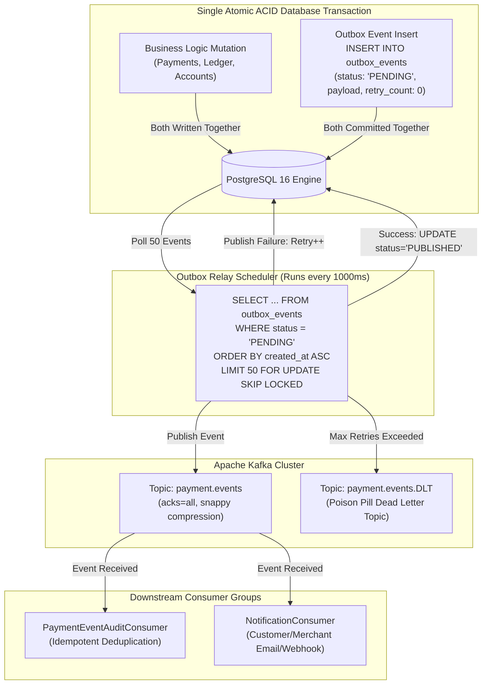
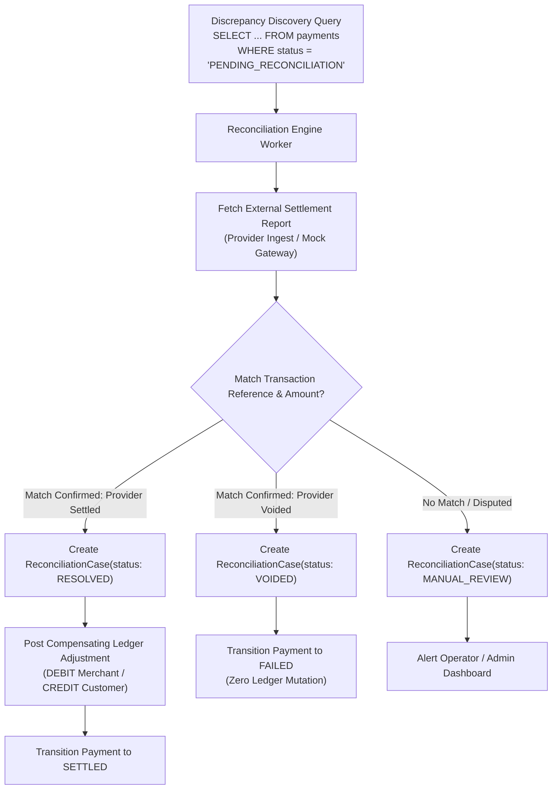

# Data Flow & Asynchronous Integration Topologies

**Governing Phase**: Phase 21 — Flagship Portfolio Packaging & GitHub Release  
**Domain**: Transactional Outbox, Event Streaming, and Reconciliation Data Pipelines  
**Status**: VERIFIED DATA FLOWS  

---

## 1. Transactional Outbox Relay Pipeline

The platform uses the **Transactional Outbox Pattern** to solve the dual-write problem across PostgreSQL and Apache Kafka:

### Outbox Guarantees:
1. **Zero Dual-Write Race**: If database transaction rolls back, no outbox event is persisted.
2. **`FOR UPDATE SKIP LOCKED`**: Enables multiple concurrent outbox workers to poll distinct batches without lock contention or thread collisions.
3. **Lease Expiry Recovery**: If a worker node crashes mid-relay, its in-flight events are unlocked automatically after 30 seconds (`lease_until < NOW()`) and re-claimed by surviving threads.

---

## 2. Reconciliation Engine Data Flow

The reconciliation engine discovers and resolves discrepancies between internal platform states and external payment providers:

### Reconciliation Invariants:
- **Historical Immutability**: The reconciliation engine **never mutates or deletes** existing posted ledger entries.
- **Compensating Transactions**: All financial corrections are executed by appending new, fully balanced double-entry transactions (`SUM(debit) == SUM(credit)`).
