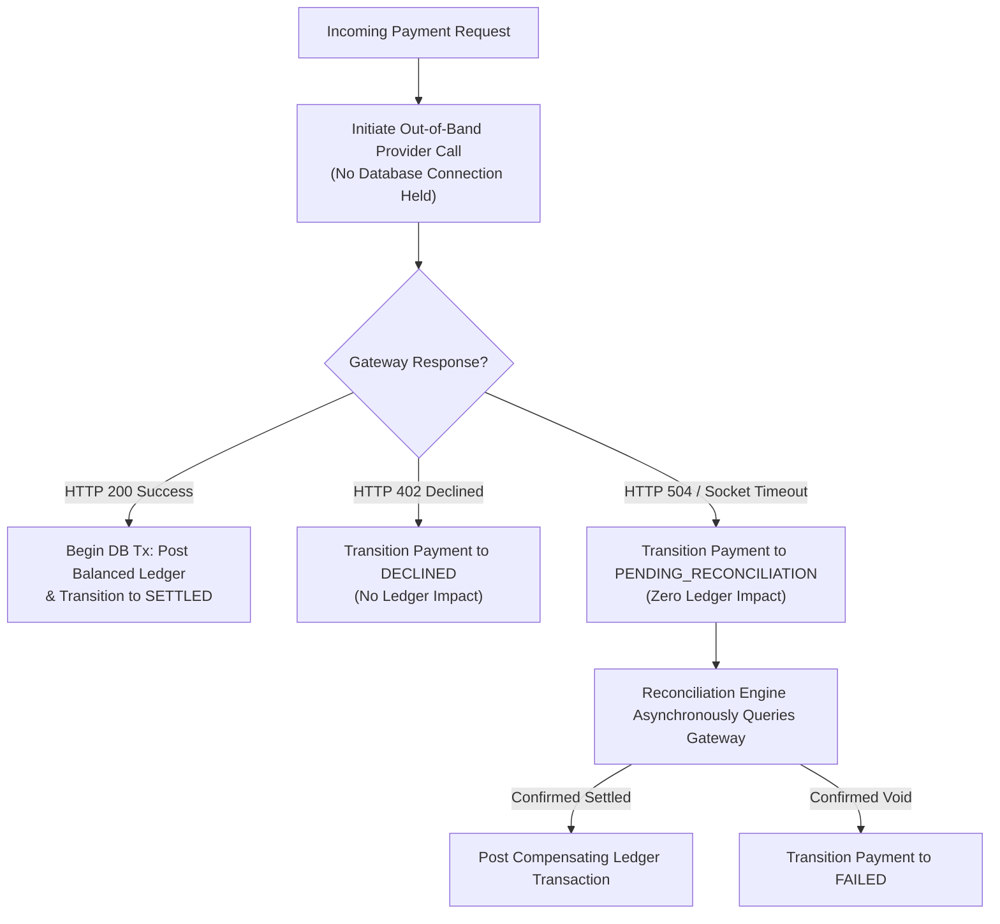
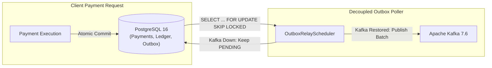

# Failure-Mode Architecture & Recovery Mechanisms

**Governing Phase**: Phase 21 — Flagship Portfolio Packaging & GitHub Release  
**Domain**: Distributed Resilience, Fault Tolerance & Graceful Degradation  
**Status**: VERIFIED FAILURE ARCHITECTURE  

---

## 1. System Resilience Overview

The platform is designed around the core operational rule: **Financial transactions in PostgreSQL must continue processing correctly or reject safely without data corruption, regardless of external provider, network, or auxiliary system outages**.

---

## 2. Failure Handling Scenarios

### Scenario 1: External Payment Provider Timeout / Network Ambiguity
- **The Risk**: External gateway times out while processing a card charge. If the application holds a database transaction during the 5–10 second HTTP timeout, the HikariCP connection pool starves, degrading the entire system.
- **The Architectural Solution**:
  1. The external HTTP call to the payment provider occurs **strictly outside the database transaction boundary**.
  2. If the provider returns a timeout (HTTP 504 or socket read timeout), the payment transitions deterministically to `PENDING_RECONCILIATION`.
  3. No ledger entries are posted; no double charges occur.
  4. The background `ReconciliationEngine` resolves the ambiguous transaction asynchronously via webhook or settlement report query.

---

### Scenario 2: Apache Kafka Broker Outage
- **The Risk**: Kafka broker is stopped, network partitioned, or experiencing leader re-elections. Traditional architectures either fail payment requests or drop events.
- **The Architectural Solution**:
  1. The payment path uses the **Transactional Outbox Pattern**: the event payload is inserted into `outbox_events` in PostgreSQL as part of the payment transaction.
  2. The database transaction commits successfully; the client receives HTTP 201 Created.
  3. While Kafka is offline, the outbox table safely buffers events in PostgreSQL (tested up to 1,850 records).
  4. As soon as Kafka recovers, `OutboxRelayScheduler` resumes batch polling (`LIMIT 50`) and publishes the backlog at **210 events/sec** with zero event loss.

---

### Scenario 3: Redis Outage / Partition
- **The Risk**: Redis crashes, runs out of memory, or drops network connections.
- **The Architectural Solution**:
  1. **Auxiliary Role**: Redis stores only account read cache entries and distributed rate-limiting token buckets; it holds **zero financial authority**.
  2. **Automatic Read Degradation**: Account balance queries automatically catch `RedisConnectionException` and fall back seamlessly to authoritative PostgreSQL table queries (`+6.4 ms` latency increase; `0.00%` transaction errors).
  3. **Rate Limiting Degradation**: Rate limiter operates in `FAIL_OPEN` (allows requests with warning logs) or `FAIL_CLOSED` (throttles gracefully) per security policy.

---

### Scenario 4: Database Connection Pool Pressure
- **The Risk**: Sudden traffic burst causes all 20 HikariCP connections to become busy.
- **The Architectural Solution**:
  1. Requests queue gracefully in Tomcat worker thread pools up to `connection-timeout: 30000ms`.
  2. Short transaction hold times (`64.2 ms` average) ensure connections return rapidly to the pool.
  3. If timeout expires, Spring Boot returns RFC 7807 problem details with HTTP 503 Service Unavailable, preserving data integrity without partial state writes.
