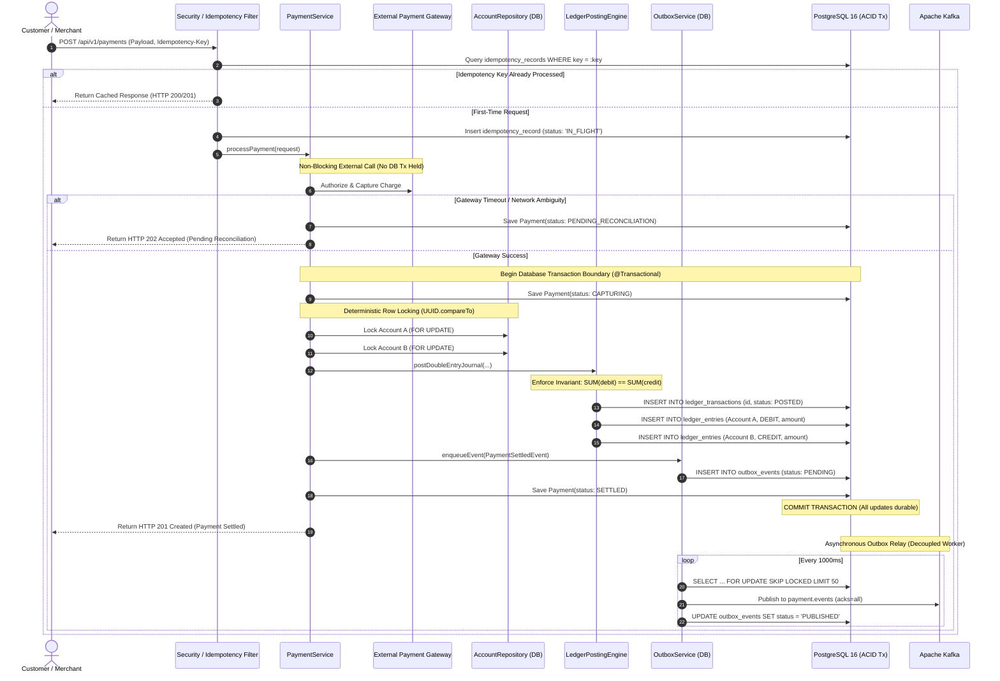
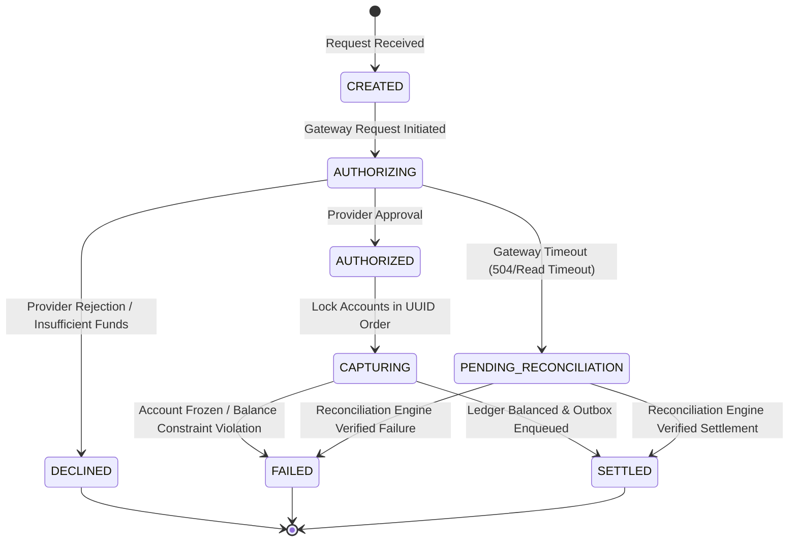

# Payment Processing & Ledger Settlement Lifecycle

**Governing Phase**: Phase 21 — Flagship Portfolio Packaging & GitHub Release  
**Domain**: Financial Transaction Processing & Double-Entry Accounting  
**Status**: VERIFIED SETTLEMENT LIFECYCLE  

---

## 1. End-to-End Payment Sequence Diagram

The diagram below details the complete execution path for a financial payment from incoming HTTP request to asynchronous Kafka notification:



---

## 2. Payment State Machine Transitions

Every payment progresses through a strictly deterministic finite state machine (FSM) defined in `PaymentState.java`:



---

## 3. Critical Financial Invariants Enforced During Settlement

1. **Deterministic Concurrency Control**:
   When transferring funds between `Account A` and `Account B`, locks are always acquired in ascending lexicographical UUID order:
   ```java
   UUID firstLock = accountA.getId().compareTo(accountB.getId()) < 0 ? accountA.getId() : accountB.getId();
   UUID secondLock = accountA.getId().compareTo(accountB.getId()) < 0 ? accountB.getId() : accountA.getId();
   accountRepository.findByIdForUpdate(firstLock);
   accountRepository.findByIdForUpdate(secondLock);
   ```
   *Guarantee*: Opposing concurrent transfers (`A ➔ B` and `B ➔ A`) acquire locks in identical sequence, completely eliminating circular wait conditions and guaranteeing **0 deadlocks**.

2. **Immutable Double-Entry Ledger Posting**:
   A payment settlement always creates:
   - Exactly one `LedgerTransaction` (`status = 'POSTED'`).
   - Exactly one debit entry: `amountMinor` debited from Payer Account.
   - Exactly one credit entry: `amountMinor` credited to Payee Account.
   - Database constraint verification: $\text{Total Debits} - \text{Total Credits} == 0$.

3. **Atomic Outbox Enqueue**:
   The `PaymentSettledEvent` is written to the `outbox_events` table in PostgreSQL within the **exact same database transaction** that posts the ledger entries. This guarantees that an event is never published to Kafka if the database transaction rolls back, and an event is never lost if the application crashes immediately following commit.
