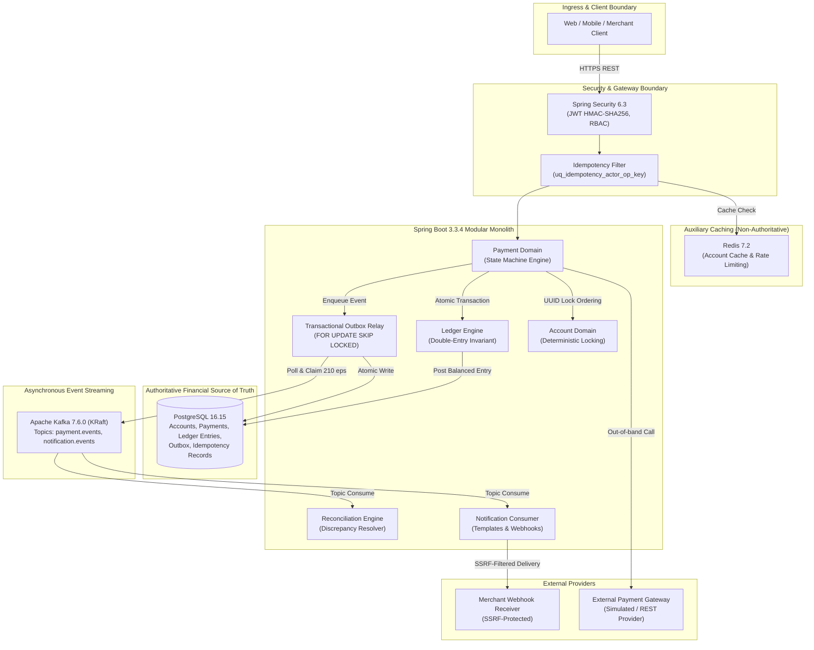
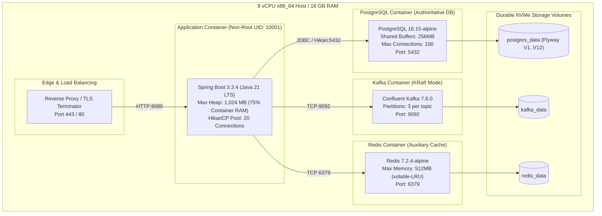

# System Architecture & Component Topology

**Governing Phase**: Phase 21 — Flagship Portfolio Packaging & GitHub Release  
**Architecture Pattern**: Modular Monolith with Transactional Outbox & Event-Driven Transport  
**Primary Engine**: Java 21 LTS, Spring Boot 3.3.4, PostgreSQL 16  

---

## 1. High-Level Architecture Overview

The Distributed Payment & Ledger Platform is engineered as a **high-throughput, modular monolith** that balances the operational simplicity of a single deployable unit with strict internal domain boundaries and event-driven decoupling. 

PostgreSQL serves as the **sole authoritative financial source of truth**. All account balances, ledger journals, idempotency tokens, and outbox events are committed transactionally to PostgreSQL. Auxiliary systems (Apache Kafka, Redis) provide event streaming and read caching without holding financial authority.

---

## 2. Component Directory & Domain Boundaries

The application enforces strict package boundaries under `com.paymentledger`:

| Domain Module | Primary Responsibility | Architectural Guarantee |
|---|---|---|
| `com.paymentledger.auth` | User authentication, token issuance, BCrypt password hashing. | Refresh-token rotation; single-use replay protection; zero token leakage. |
| `com.paymentledger.account` | Account lifecycle, balance queries, currency validation. | Non-overdraft check constraints; cached reads degrade to DB fallback. |
| `com.paymentledger.payment` | Payment state machine (`CREATED`..`SETTLED`, `FAILED`). | Zero double-charge; non-blocking external provider execution. |
| `com.paymentledger.ledger` | Immutable double-entry posting engine. | Strict invariant: $\sum \text{Debits} == \sum \text{Credits}$; append-only journal entries. |
| `com.paymentledger.outbox` | Transactional outbox polling and batch publishing. | Dual-write problem eliminated; DB state and event commit atomically. |
| `com.paymentledger.messaging` | Kafka topic configurations, serializers, consumer groups. | At-least-once event delivery; consumer idempotency deduplication. |
| `com.paymentledger.refund` | Compensating refunds and payment reversals. | Ledger history never mutated; refunds execute via inverse credit/debit entries. |
| `com.paymentledger.reconciliation`| Internal vs provider discrepancy discovery and resolution. | Automatic un-reconciled payment discovery; compensating adjustment transactions. |
| `com.paymentledger.notification`| Asynchronous email/SMS/webhook dispatch. | Notification failures strictly isolated from financial payment commits. |
| `com.paymentledger.admin` | Operations, account freeze/unfreeze, audit log queries. | Least privilege (`ROLE_ADMIN`); mandatory clamped pagination (<= 100). |
| `com.paymentledger.shared` | RFC 7807 error formatting, correlation ID filters, security. | Uniform error contracts; end-to-end request tracing via SLF4J MDC. |

---

## 3. Production Deployment Topology

The platform deploys as an isolated, containerized stack designed for reliability and resource predictability:

