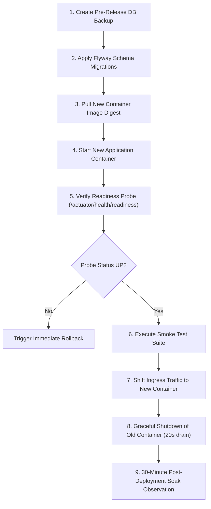

# Controlled Rollout & Deployment Strategy

**Governing Phase**: Phase 20 — Complete Production-Readiness Verification  
**Audience**: Release Engineers, DevOps / SRE, Production Engineering  
**Status**: APPROVED ROLLOUT STRATEGY  

---

## 1. Overview & Core Philosophy

The Distributed Payment & Ledger Platform processes authoritative financial transactions. Production deployments must be predictable, auditable, zero-downtime, and completely reversible without risking financial ledger inconsistency or transaction loss.

### Capability Classification:
- **`SUPPORTED NOW`**: Fully implemented and validated in the current single-node modular monolith architecture with containerized services.
- **`FUTURE OPTION`**: Architectural enhancements reserved for future distributed multi-node orchestrations (e.g. automated canary traffic splitting via service meshes).

---

## 2. Pre-Deployment Gate Checklist (`SUPPORTED NOW`)

Before initiating any production deployment, the release engineer must verify:
- [ ] **CI Quality Gates**: Master branch build passed 100% of unit, integration, and security scans (0 test failures).
- [ ] **Artifact Verification**: Docker image digest verified; non-root user and SBOM present.
- [ ] **Database Backup**: Fresh logical PostgreSQL backup created and stored in isolated storage within the last 2 hours.
- [ ] **Flyway Forward Compatibility**: Migrations are strictly additive (new tables, nullable columns, new indexes). Destructive drops (`DROP TABLE`, `DROP COLUMN`) are strictly prohibited in rolling releases.
- [ ] **Secrets Verification**: Required environment variables (`DB_PASSWORD`, `JWT_SECRET`, etc.) configured in target environment.
- [ ] **On-Call Alignment**: SRE on-call team alerted; release window scheduled during low-traffic operational window.

---

## 3. Standard Deployment Sequence (`SUPPORTED NOW`)



### Detailed Steps:
1. **Schema Pre-Migration**:
   Flyway migrations apply automatically on application bootstrap, or are executed via pre-deployment job:
   ```bash
   ./scripts/validate-migrations.sh
   ```
2. **Container Launch**:
   Run the newly tagged container alongside the current container on an alternate internal port.
3. **Healthcheck & Readiness Verification**:
   Poll `/actuator/health/readiness` until it returns HTTP 200 with database connectivity confirmed:
   ```bash
   curl -f http://localhost:8080/actuator/health/readiness || exit 1
   ```
4. **Smoke Testing**:
   Execute synthetic smoke test transactions (health check, customer login, account read, idempotent payment replay).
5. **Traffic Cutover**:
   Update reverse proxy / load balancer upstream to point to the new container.
6. **Graceful Drain**:
   Send `SIGTERM` to the old container. Spring Boot's graceful shutdown (`server.shutdown: graceful`, `timeout-per-shutdown-phase: 20s`) allows in-flight HTTP requests and transactional outbox publishes to complete safely.

---

## 4. Rollback Decision & Procedure (`SUPPORTED NOW`)

### Rollback Triggers:
An immediate rollback is declared if any of the following occur within 30 minutes post-deployment:
1. `/actuator/health/readiness` fails or flaps.
2. HTTP 5xx error rate exceeds **0.1%** on `/api/v1/payments`.
3. Payment p95 latency exceeds **300 ms** for > 2 consecutive minutes.
4. Any ledger imbalance alert fires (`ledger_imbalance_total > 0`).

### Rollback Procedure:
1. **Reroute Ingress**: Revert reverse proxy upstream back to previous stable container instance.
2. **Verify Stability**: Confirm previous container resumes processing traffic cleanly.
3. **Database Integrity Note**: Because migrations are strictly forward-compatible, the older application version can safely run against the newly migrated schema without destructive database rollbacks.
4. **Post-Rollback Audit**: Execute database financial consistency check to verify zero orphan or unbalanced transactions occurred during the incident.

---

## 5. Advanced Rollout Strategies (`FUTURE OPTION`)

The following capabilities are recognized as future deployment options once distributed cluster orchestration is adopted:
- **Blue/Green Deployment with Instant DNS Swap** (`FUTURE OPTION`): Running two complete parallel production environments.
- **Canary Traffic Splitting (1% ➔ 10% ➔ 50% ➔ 100%)** (`FUTURE OPTION`): Progressive traffic migration via Envoy / API gateway with automated rollback upon metric regression.
- **Automated Chaos Engineering Drills in Staging** (`FUTURE OPTION`): Automated continuous pod termination and latency injection.
