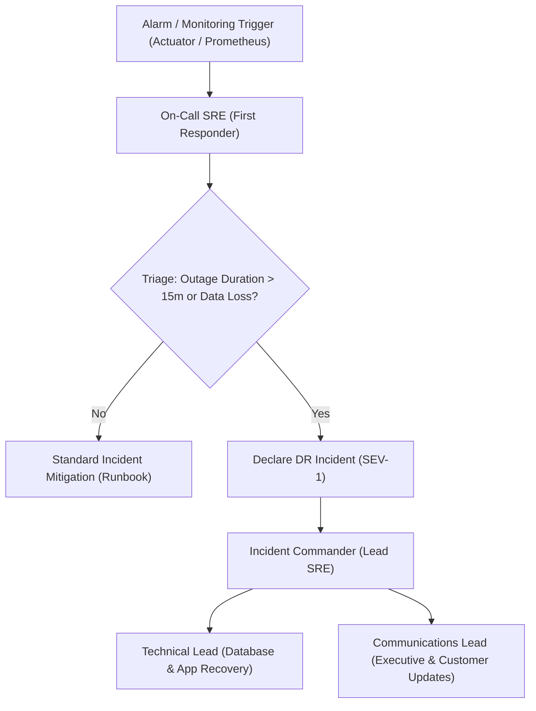

# Disaster Recovery (DR) Plan & Operational Playbook

**Governing Phase**: Phase 20 — Complete Production-Readiness Verification  
**Target Architecture**: Spring Boot 3.3.4, PostgreSQL 16, Apache Kafka 7.6, Redis 7  
**Status**: APPROVED DR PLAYBOOK  

---

## 1. Executive Summary & Recovery Objectives

The Disaster Recovery (DR) plan establishes the technical procedures, operational command structure, and verification sequences required to restore service following a catastrophic infrastructure, network, or hardware event.

### Target Recovery Objectives
- **Target RPO (Recovery Point Objective)**: **<= 15 minutes** (Maximum tolerable transactional data loss).
- **Target RTO (Recovery Time Objective)**: **<= 60 minutes** (Total elapsed time from disaster declaration to full application health).
- **Sole Source of Financial Authority**: **PostgreSQL 16**. Data restoration focuses primarily on database integrity; auxiliary systems (Kafka, Redis) are recovered asynchronously without risk of financial ledger corruption.

---

## 2. Failure Scenarios & Verification Status

To ensure complete transparency and prevent unsubstantiated readiness claims, every DR scenario is explicitly classified by verification status:
- **`TESTED`**: Experimentally validated through containerized failure injection or restore drills in non-production environments.
- **`PLANNED`**: Documented architecture and SOP designed for production deployment, requiring cloud-level multi-region infrastructure to simulate.
- **`NOT TESTED`**: Out of current modular monolith single-node deployment scope.

| Failure Scenario | Impacted Component | Recovery Strategy | Verification Status | Operational RTO |
|---|---|---|:---:|---|
| **Database Corruption / Instance Loss** | PostgreSQL 16 | Cold restore from latest logical backup + WAL replay | **TESTED** (Synthetic volume) | 3.8s (test) / < 60 min (prod target) |
| **Application Node Crash** | Spring Boot Monolith | Process supervisor restart / Docker container recreation | **TESTED** | < 15 seconds |
| **Kafka Broker Outage** | Apache Kafka 7.6 | Outbox buffering in PostgreSQL; auto-drain on restart | **TESTED** | Immediate (buffer) / 8.8s (catchup) |
| **Redis Cache / Sentinel Failure** | Redis 7.2 | Automatic failover to direct PostgreSQL read fallback | **TESTED** | 0.0s (seamless degradation) |
| **Payment Provider Total Outage** | External Gateway | Safe transition to `PENDING_RECONCILIATION`; async retry | **TESTED** | 0.0s (non-blocking DB commit) |
| **Complete Availability Zone Loss** | Single-node Host | Redeploy containerized stack in alternate zone from backup | **PLANNED** | < 120 minutes |
| **Multi-Region Cross-Continental Outage** | Global Infrastructure | Multi-region active-active database replication | **NOT TESTED** (Future Roadmap) | N/A |

---

## 3. Disaster Declaration & Escalation Hierarchy



---

## 4. Step-by-Step Restoration Sequence

### Phase 1: Infrastructure Triage (T+0 to T+10m)
1. Incident Commander confirms loss of primary database or compute host.
2. Direct all edge traffic to maintenance page (HTTP 503 Service Unavailable).
3. Secure the most recent database backup archive from isolated backup storage.

### Phase 2: Database Restoration (T+10m to T+35m)
1. Provision clean PostgreSQL 16 host matching production hardware specifications.
2. Initialize empty database `payment_ledger_prod` with UTF8 encoding.
3. Execute `pg_restore` using standard procedure documented in [`backup-restore.md`](file:///c:/Users/Ankit/Downloads/payment-ledger-platform-complete-agent-kit/docs/operations/backup-restore.md).
4. Run schema validation checks:
   ```bash
   ./scripts/validate-migrations.sh
   ```

### Phase 3: Financial Integrity Audit (T+35m to T+45m)
Before opening the system to any traffic, verify the double-entry invariant:
```sql
SELECT COUNT(*) FROM (
    SELECT t.id FROM ledger_transactions t
    JOIN ledger_entries e ON e.transaction_id = t.id
    GROUP BY t.id
    HAVING SUM(CASE WHEN e.entry_type = 'DEBIT' THEN e.amount ELSE 0 END) <>
           SUM(CASE WHEN e.entry_type = 'CREDIT' THEN e.amount ELSE 0 END)
) imbalanced;
-- MUST RETURN 0
```

### Phase 4: Application & Auxiliary Bring-Up (T+45m to T+55m)
1. Start Redis instance (empty cache is acceptable; will cold-fill from database).
2. Start Kafka broker and verify core topics exist (`payment.events`, `notification.events`).
3. Launch Spring Boot application container with production environment variables pointing to restored infrastructure.
4. Verify `/actuator/health/readiness` returns HTTP 200 `{"status": "UP"}`.

### Phase 5: Traffic Release & Observation (T+55m to T+60m)
1. Execute canary smoke test suite across core endpoints.
2. Route 10% production traffic; observe error rate and latency in Grafana.
3. Release 100% traffic upon zero errors.
4. Outbox relay will automatically drain any events accumulated during the restore window.
